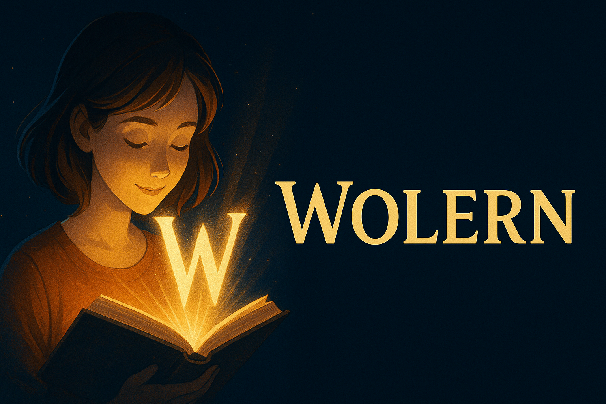

# Wolern   

 

<table>
<tr>
<td width="40%">
  
</td>
<td>
  <p><strong>Wolern is a Python-based personal project designed to help me (and others) learn English vocabulary effectively using technology.</strong></p>
  <p>The project aims to combine basic programming, Natural Language Processing (NLP) techniques, and interactive exercises.</p>
  <p>Personal project combining Python, NLP, and smart exercises.</p>
</td>
</tr>
</table>
<p align="left">
  
</p>

## 🎯 Project Goals

- Improve and expand English vocabulary.
- Use Python to develop learning tools.
- Experiment with NLP libraries like NLTK, spaCy, and Hugging Face.
- Practice project management and software development skills.

## ⚙️ Features (Planned)

- Word collection and saving.
- Automatic definition and example sentence fetcher.
- Flashcard-style review system.
- Simple command-line or web interface.
- Quizzes for active recall.
- Progress tracking.

## 📚 Tech Stack

- Python 3.x
- NLP Libraries:
  - spaCy
  - NLTK
  - Hugging Face Transformers (for examples)
- SQLite or JSON for storing words.
- (Future) Web Framework: Flask or FastAPI.

## 💡 Why this project?

As a non-native English speaker and programming learner, I created Wolern to:
- Combine language learning with coding practice.
- Apply software engineering principles.
- Have fun with real data and NLP!

## 🛠 Installation

1. Clone the repo.
2. Create a virtual environment:

```bash
python -m venv venv
source venv/bin/activate

pip install -r requirements.txt
```

## 🛠 Usage

> Work in progress — command-line and GUI examples will be added.

## 📌 Roadmap
# 📍 Wolern Project Roadmap

## ✅ Phase 1: Core CLI App
- [x] Define project goal.
- [x] Design vocabulary JSON structure.
- [x] Set up virtual environment and basic files.
- [x] Implement word addition (with saving to JSON).
- [x] Load and display existing vocabulary from JSON.
- [x] Fetch synonyms (NLTK + Datamuse).
- [x] Fetch definitions and parts of speech (WordNet).
- [x] Add CEFR level checker (scraper).
- [x] Add audio pronunciation saving.
- [ ] Track learning stage and update based on correct answers.

---

## ✅ Phase 2: CLI Main Features
- [x] Create main menu (text-based).
- [ ] Option to add new word manually.
- [ ] Option to scan text file for unknown words (`.txt` support first).
- [ ] Text scanner - support `.docx` files (future).
- [ ] Text scanner - support `.pdf` files (future).
- [ ] Option to show full vocabulary list (nicely formatted).
- [ ] Option to launch quiz (multiple choice / writing).
- [ ] Save all changes reliably.
- [ ] Implement clean and graceful exit.

---

## 🔵 Phase 3: GUI Prototype (Tkinter)
- [ ] Build simple window for adding new words.
- [ ] Build window for doing quizzes.
- [ ] Show basic stats: number of words, learning progress.
- [ ] Handle JSON operations via GUI buttons.

---

## 🔵 Phase 4: Web App (Flask or FastAPI)
- [ ] Set up backend API for word operations.
- [ ] Create simple web frontend (Bootstrap or TailwindCSS).
- [ ] Add login system (optional).
- [ ] Show stats and quizzes online.
- [ ] Deploy to free hosting service (Render, Vercel, etc.).

---

## ✍️ Phase 5: Documentation & Polish
- [ ] Polish README (add CLI usage examples and screenshots).
- [ ] Add LICENSE file (MIT License or similar).
- [ ] Write CONTRIBUTING.md (optional if you want to allow open contributions).
- [ ] Prepare small promotional materials (like demo GIFs).

---

## 🧪 Phase 6: Testing & Stability
> Goal: Ensure that Wolern works correctly, reliably, and is easy to maintain.

### Unit tests
- [ ] Load and save vocabulary (JSON reading/writing).
- [ ] Add word to vocabulary.
- [ ] Fetch synonyms, definitions, translations (mocked API responses).
- [ ] Track learning stage updates.

### Integration tests
- [ ] End-to-end test: Add word manually.
- [ ] End-to-end test: Scan `.txt` file for unknown words.

### Error handling tests
- [ ] Handle missing files (e.g., missing `cefr_cache.json`).
- [ ] Handle corrupted or invalid JSON.
- [ ] Handle unsupported file formats during scanning.

### Performance tests (optional)
- [ ] Measure time for scanning large text files.
- [ ] Measure time for loading large vocabulary files.

### CLI menu stability
- [ ] Test all menu options for clean exit and no crashes, even with empty or minimal data.

### Testing tools
- Standard: `unittest`
- (Optional upgrade later) `pytest` for better reports.

---

# 🎯 MVP Target
✅ CLI where you can:
- Add new words.
- Save and load vocabulary.
- Quiz yourself.
- Track learning stages.
- Scan `.txt` files for unknown words.

---

# 🛣️ Project Phases Summary
| Phase | Name | Description                                                          |
|:------|:-----|:---------------------------------------------------------------------|
| Phase 1 | Core CLI App | can add word, save JSON, enrich (synonyms, defs, tags, CEFR, audio). |
| Phase 2 | CLI Main Features | adds text‑scanner and quiz menu.                                     |                                
| Phase 3 | GUI Prototype (Tkinter) | simple windows for add / quiz.                                       |
| Phase 4 | Web App (Flask or FastAPI) | Flask or Django with same backend logic.                             |
| Phase 5 | Documentation & Polish |                                                                      |
| Phase 6 | Testing & Stability |                                                                      |

---
## 🧑‍💻 Contributing

Right now this is a solo learning project, but contributions are welcome for feedback, ideas, or suggestions.

---

## Release Milestones
MVP CLI – can add word, save JSON, enrich (synonyms, defs, tags, CEFR, audio).

CLIv1 – adds text‑scanner and quiz menu.

Tkinter prototype – simple windows for add / quiz.

Web beta – Flask or Django with same backend logic.

---

### Data sources 
** CEFR‑J Vocabulary & Grammar Profile
* ** — © Tono Laboratory, TUFS.  Used under the terms: “CEFR‑J vocabulary and grammar profile datasets can be used for research and commercial purposes with no charge, provided that you cite the dataset properly.” 
* **Octanove Vocabulary Profile (C1/C2)
* ** — Licensed under CC BY‑SA 4.0.
